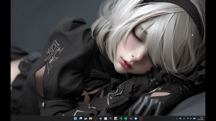

# YoRHa System Data Manager (PDF Aracı) ⚔️
*For the Glory of Mankind.*

Bu proje, NieR: Automata evreninin ikonik **YoRHa OS** arayüzünden ilham alınarak geliştirilmiş, güçlü ve şık bir masaüstü PDF yönetim aracıdır. Geleneksel sıkıcı araçların aksine; yüksek çözünürlüklü önizleme, sürükle-bırak desteği ve asenkron animasyonlu "Tech" yükleme ekranı ile kullanıcılara benzersiz bir deneyim sunar.

## 🎥 Sistem Önizlemesi
*(Aşağıdaki videoyu oynatarak arayüzü ve işlemleri inceleyebilirsiniz)*

<p align="center">
  
</p>

> **Not:** Giften kaynaklı çözünürlük berbat ve hayır gif donmadı bi kaç saniye boşluk var. Optimizasyon baby... 

---

## ⚙️ Temel İşlevler

Bu araç, PDF dosyaları üzerinde ihtiyaç duyulan tüm temel yapısal modifikasyonları destekler:

*   **📄 Çoklu PDF Birleştirme:** Listeye eklenen veya sürüklenen birden fazla PDF dosyasının, sadece sizin belirlediğiniz sayfa aralıklarını tek bir belgede birleştirir.
*   **✂️ Özel Sayfa Ayırma (Extract):** Büyük bir PDF dosyasının içinden sadece istediğiniz sayfaları (Örn: 1-5, 8, 12) kopararak yeni bir dosya olarak kaydeder.
*   **🗂️ Tek Tek Sayfalara Bölme (Split):** Seçilen belgeyi tamamen parçalayarak, her bir sayfasını belirlediğiniz klasöre ayrı ayrı PDF'ler olarak dağıtır.
*   **👁️ Yüksek Çözünürlüklü Önizleme:** PyMuPDF motoru sayesinde PDF sayfaları render edilir ve DPI destekli ekranda keskin bir şekilde önizlenir. Sadece işleme dahil edilecek sayfalar gösterilir.
*   **🖱️ Sürükle-Bırak (Drag & Drop):** Dosyalarınızı Windows gezgininden doğrudan uygulamanın içerisine fırlatarak anında işlem sırasına alabilirsiniz.
*   **✨ Özel Tasarım UI:** Açılış animasyonu (Splash Screen), DPI duyarlı (bulanıklaşmayan) keskin arayüz, özel renk paleti, dantel (lace) overlay'i ve Windows 11 API entegrasyonu ile boyanmış başlık çubuğu.

---

## 🛠️ Kullanılan Kütüphaneler ve Teknolojiler

Projenin altyapısında hızlı render almak ve modern bir masaüstü deneyimi sunmak için aşağıdaki kütüphaneler kullanılmıştır:

*   **[Python 3.x]** - Temel geliştirme dili.
*   **[Tkinter]** - Çekirdek masaüstü GUI kütüphanesi.
*   **[PyMuPDF (fitz)]** - Hızlı PDF okuma, manipülasyon (birleştirme/bölme) ve yüksek kaliteli sayfa renderlama (Pixmap) motoru.
*   **[Pillow (PIL)]** - Arayüzdeki görsellerin (Dantel motifi, varsayılan ekran ve önizleme resimleri) yeniden boyutlandırılması ve yönetimi.
*   **[tkinterdnd2]** - İşletim sistemi seviyesindeki sürükle-bırak (Drag & Drop) fonksiyonlarını Tkinter'a bağlayan altyapı.
*   **[ctypes]** - Yüksek DPI keskinliğini zorlamak ve Windows başlık çubuğu (DWM) rengini değiştirmek için işletim sistemi API bağlantıları.

---

## 🚀 Kurulum ve Çalıştırma

Projeyi kendi bilgisayarınızda çalıştırmak için aşağıdaki adımları izleyebilirsiniz.

**1. Gerekli kütüphaneleri kurun:**
```bash
pip install pymupdf pillow tkinterdnd2

